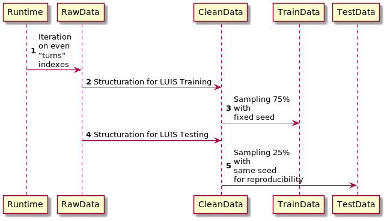
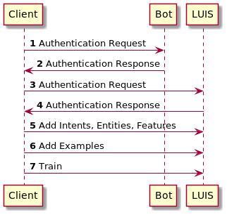
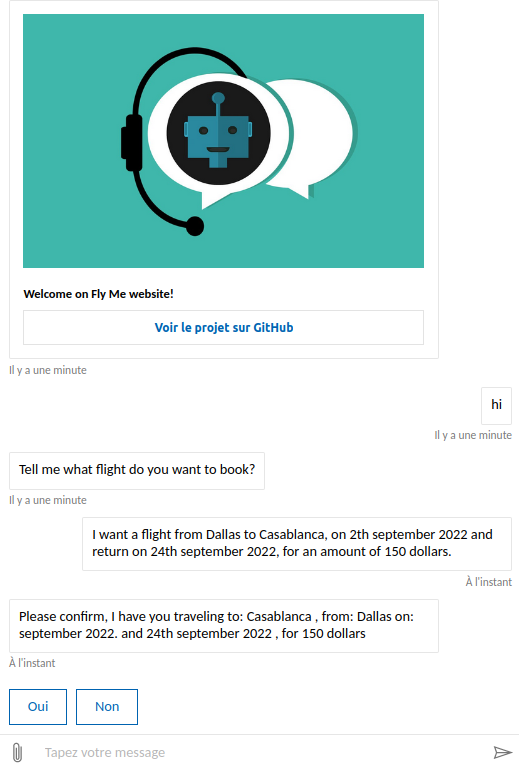

# Dyadic
IA and robotic

## Caractère industrialisable

### Preprocessing

Les données du répertoire /data ont été produites à partir du script en Python, [Preprocessing](https://github.com/sha-cmd/Dyadic/blob/main/preprocessing.py), lequel fut appliqué sur les données en [lien](https://www.microsoft.com/en-us/research/project/frames-dataset/#!download).

### Pipeline

Le script en Python, [Pipeline](https://github.com/sha-cmd/Dyadic/blob/main/pipeline.py), permet de pousser les données et d’entraîner l’IA LUIS.

### Publishing

Le script en Python, [Publish](https://github.com/sha-cmd/Dyadic/blob/main/publish_luis.py), permet de publier le point d’accès à l’API Rest de l’IA LUIS.

## Adaptation du [modèle](https://github.com/microsoft/BotBuilder-Samples/tree/main/samples/python/21.corebot-app-insights) à la prise de réservation de billet d’avion

Le fichier au format JSON, [Welcome Card](https://github.com/sha-cmd/Dyadic/blob/main/bots/resources/welcomeCard.json), permet de personnaliser l’accueil du client par le bot.

Le script en Python, [Main Dialog](https://github.com/sha-cmd/Dyadic/blob/main/dialogs/main_dialog.py), contient une adaptation dans la méthode "final_step". Celle-ci est une récapitulation de la réservation ayant été prise et confirmée.

Le script en Python, [Cancel Dialog](https://github.com/sha-cmd/Dyadic/blob/main/dialogs/cancel_and_help_dialog.py), contient une aide adaptée en cas de frappe du mot « help » par le client.

Le script en Python, [Booking Dialog](https://github.com/sha-cmd/Dyadic/blob/main/dialogs/booking_dialog.py), contient une adaptation pour délivrer un comportement d’écoute auprès du client, s’il se trompe dans sa demande. De plus, ce script permet de lancer des traces à l’App Insights pour permettre la maintenance et l’amélioration de notre IA d’Azure, LUIS.

Le script en Python, [LUIS Helper](https://github.com/sha-cmd/Dyadic/blob/main/helpers/luis_helper.py), contient l’objet et la méthode servant d’interface à notre application pour communiquer et surtout recevoir les éléments compris par LUIS dans une hiérarchie qui leur est propre. En effet, celle-ci est adaptée aux besoins de notre application pour la réservation de billet d’avion.

Le script en Python, [Application](https://github.com/sha-cmd/Dyadic/blob/main/app.py), instancie les communications nécessaires au démarrage de notre application et lance le programme du bot, pour un tchat wéb.

Le script en Python, [Config](https://github.com/sha-cmd/Dyadic/blob/main/config.py), est une interface entre les variables d’environnement et le processus de notre Chatbot. Le code comprend en plus des clés pour LUIS Authoring, car le [pipeline](https://github.com/sha-cmd/Dyadic/blob/main/pipeline.py) le requiert, pour transférer les données d’entraînement, entre autre chose.

Le script en Python, [Booking Details](https://github.com/sha-cmd/Dyadic/blob/main/booking_details.py) est une classe pour instancier un objet canonique pour nos réservations, ce premier reçoit les entités par LUIS, ou au cours du dialogue en cascade (.cf "WaterFall Dialog") dans le script en Python [Booking Dialog](https://github.com/sha-cmd/Dyadic/blob/main/dialogs/booking_dialog.py).
